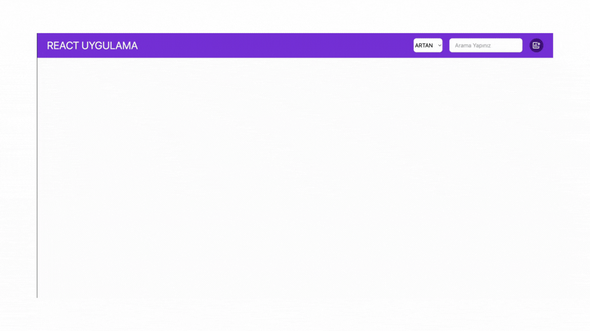

# React-Redux Add Product Uygulama Projesi 

- Bu proje, modern web uygulamaları geliştirmek için çeşitli popüler JavaScript kütüphaneleri ve araçlarını kullanır.

 ## Kullanılan Teknolojiler ve Kütüphaneler

- React: Kullanıcı arayüzleri oluşturmak için kullanılan popüler bir JavaScript kütüphanesi. (react: ^18.3.1, react-dom: ^18.3.1)
- React Router DOM: React uygulamalarında yönlendirme işlemlerini yönetmek için kullanılır. 
- react-router-dom: ^6.24.
- Redux Toolkit: Durum yönetimini kolaylaştırmak için kullanılan bir araç seti. (@reduxjs/toolkit: ^2.2.6)
- React Redux: React ile Redux'u bağlamak için kullanılır. (react-redux: ^9.1.2)
UI ve İkonlar
- React Icons: Popüler ikon setlerini kolayca kullanabilmek için bir kütüphane. (react-icons: ^5.2.1)

Bu kütüphaneler ve araçlar, modern web uygulamalarını daha hızlı, verimli ve test edilebilir hale getirmek için kullanılır. Projenin gereksinimlerine göre farklı kütüphaneler eklenebilir veya mevcut kütüphaneler güncellenebilir.

